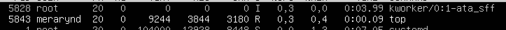
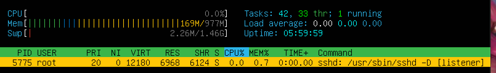

## Операционные системы UNIX/Ubuntu (Базовый).
____________________
## Part 1. Установка ОС.
____________________
* Устанавливаем [Ubuntu-20.04-Server-LTS](https://old-releases.ubuntu.com/releases/20.04.0/ubuntu-20.04-live-server-amd64.iso) , [инструкция](https://linuxconfig.org/how-to-install-ubuntu-20-04-on-virtualbox) в VirtualBox и проверяем установленную версию командой:
Версия Ubuntu, `cat /etc/issue`

____________________
## Part 2. Создание пользователя.
____________________
*1.  Создание нового пользователя `sudo useradd -G adm user1`

*2.  Просмотр нового пользователя `cat /etc/passwd`

____________________
## Part 3. Настройка сети ОС.
____________________
*1. Задать название машины вида user-1
`sudo nano /etc/hostname` - далее Изменилa название в редакторе

*2. Изменилa часовую зону 
`sudo timedatectl set-timezone Europe/Moscow`

*3. Просмотрела сетевые интефейсы - `ifconfig -a`

Сетевой интерфейс — физическое или виртуальное устройство, предназначенное для передачи данных между программами через компьютерную сеть.
Сетевое взаимодействие Ubuntu-компьютера происходит через сетевые интерфейсы. Любые данные, которые компьютер отправляет в сеть или получает из сети проходят через сетевой интерфейс.
Интерфейс определён реализацией модели TCP/IP для того чтобы скрыть различия в сетевом обеспечении и свести сетевое взаимодействие к обмену данными с абстрактной сущностью.
lo - этоинтерфейс петли обратной связи.
Одна из задач технологии обратной петли — перенаправлять исходящий системный пакет на вход системы, не давая ему попасть к OSI. Если попроще, вот так работает данный интерфейс: Кроме того, интерфейс loopback осуществляет взаимодействие исполняемых на одном хосте процессов с сетевой подсистемой. Есть и полная схема осуществления loopback интерфейса: Сфера применения интерфейса обратной петли довольно объемная. Ее используют и в системе pfSense — дистрибутив, создающий межсетевой экран/машрутизатор. В таком случае loopback нужен в качестве метода взаимодействия между локальными процессами через сетевую подсистему.
*4. Используя консольную команду `sudo dhclient -v` получить ip адрес устройства

Протокол динамической настройки хоста (DHCP) — это сетевая служба, которая позволяет хост-компьютерам автоматически назначать настройки с сервера, а не вручную настраивать каждый сетевой хост. 
Клиент настроенный на получение адреса по протоколу DHCP посылает запрос к серверу, и тот в свою очередь предоставляет свободный IP адрес клиенту во временное пользование — так сказать в аренду (в дальнейшем я буду это так и называть). Срок аренды IP адреса настраивается на сервере. DHCP позволяет значительно уменьшить затраченное время на настройку сети, так же позволяет подключать клиента из одной сети в другую без изменения сетевых параметров. Для провайдеров услуг — DHCP позволяет съэкономить на пуле IP адресов, и присвоить статический IP любому оборудованию.
*5.  Определила внешний ip-адрес шлюза `curl ifconfig.me/ip` (ip) 

и внутренний IP-адрес шлюза `ip route`

*6. Задала статичные настройки ip, gw, dns - `sudo nano /etc/netplan/00-installer-config.yaml`

`sudo netplan apply`
`ip addr show dev enp0s3`
enp0s3: Имя сетевого интерфейса в виде строки. «en» означает Ethernet, «p0» — номер шины карты Ethernet, а «s3» — номер слота.

*7.  Пропинговала
`ping 1.1.1.1. + ^C`

`ping ya.ru  + ^C`

В выводе команды есть фраза "0% packet loss"
____________________
## Part 4. Обновление ОС.
____________________
Обновила пакеты
 `sudo apt-get update`

____________________
## Part 5. Использование команды sudo.
____________________
Sudo - позволяет выполнять привилегированные команды обычным пользователям без необходимости ввода пароля суперпользователя root 
Поменяла hostname от имени 1 польз. `sudo hostname user-1` 

   

____________________
## Part 6. Установка и настройка службы времени.
____________________
Настроила службу автоматической синхронизации времени
`timedatectl show`

   

____________________
## Part 7. Установка и использование текстовых редакторов.
____________________
*1. 
`sudo apt install vim`
`sudo apt install nano`
`sudo apt install mcedit`
Создалa файл text_VIM.txt в vim, для выхода с сохранений изменений - esc - SHIFT + :x

![Ubuntu]21.png)

Создалa файл text_NANO.txt в nano, для выхода с сохранений изменений - cntrl + x - yes - name file

Создалa файл text_MCEDIT.txt в mcedit, для выхода с сохранений изменений - esc - 2 - yes - name file

*2. Заменилa текст в файл text_VIM.txt в vim, для выхода без сохранений изменений - esc - SHIFT + : - q! 

Заменилa текст в файл text_NANO.txt в nano, для выхода без сохранений изменений - cntrl + x - no

Заменилa текст в файл text_MCEDIT.txt в mcedit, для выхода без сохранений изменений  - esc - no

*3. 
После поиска в vim /

Команда для замены :%s/merarynd/merarynd

После поиска в nano Ctrl+W 

Команда для замены Ctrl+\ - merarynd - merarynd - y

После поиска в mcedit ESC 7- merarynd

Команда для замены ESC 4- merarynd - merarynd

____________________
## Part 8. Установка и базовая настройка сервиса SSHD.
____________________
*1. Для установки использовала команду 
`sudo apt install openssh-server -y`

*2. Добавила автостарт службы
`sudo systemctl enable ssh`

*3. Перенастроила службу SSHd на порт 2022.
   `sudo apt-get update` &&
 ` sudo apt-get install openssh-server net-tools` && 
  `sudo systemctl enable ssh` &&  # добавляем сервер в автозапуск
   `sudo sed -i '/Port/c\Port 2022' /etc/ssh/sshd_config` &&  # изменяем порт
  sudo systemctl restart sshd;
  clear;
  ps -C sshd;
  netstat -tan;`

Используя команду ps, показала наличие процесса sshd
Команда ps выводит список текущих процессов на вашем сервере.
Флаг -с для фильтрации по группам 
`ps -C sshd`
netstat (network statistics) — утилита командной строки, выводящая на дисплей состояние TCP-соединений.
Опции –t показывают активные соединения TCP, флаг –a , также будут показаны сокеты, ожидающие соединения, -n показывает сетевые адреса как числа. netstat обычно показывает адреса как символы. Этот дисплей даст вам список всех серверов, которые в настоящее время работают в вашей системе.
____________________
## Part 9. Установка и использование утилит top, htop.
____________________
top - интерактивный просмотрщик процессов
Ввелa команду top 
Cписок процессов

Из этого:
*uptime: 

*количество авторизованных пользователей:

*общую загрузку системы:

*общее количество процессов:

*загрузку cpu:

*загрузка памяти:

*pid процесса занимающего больше всего памяти:

*pid процесса, занимающего больше всего процессорного времени:

- Вывод htop по отсортированным PID,PERCENT_CPU,PERCENT_MEM, TIME .
Сортируем с помощью команды htop -s " ".
*PID:

*PERCENT_CPU:

*PERCENT_MEM:

*TIME:

*pid процесса занимающего больше всего памяти 
`ps -eo pid,ppid,cmd,%mem --sort=-%mem | head`

*pid процесса, занимающего больше всего процессорного времени
`top -o %MEM -b -n 1|head -n 12|tail -6`

________________
Опции утилиты ps:
-A, -e, (a) - выбрать все процессы;
-a - выбрать все процессы, кроме фоновых;
-d, (g) - выбрать все процессы, даже фоновые, кроме процессов сессий;
-N - выбрать все процессы кроме указанных;
-С - выбирать процессы по имени команды;
-G - выбрать процессы по ID группы;
-p, (p) - выбрать процессы PID;
--ppid - выбрать процессы по PID родительского процесса;
-s - выбрать процессы по ID сессии;
-t, (t) - выбрать процессы по tty;
-u, (U) - выбрать процессы пользователя.
Опции форматирования:
-с - отображать информацию планировщика;
-f - вывести максимум доступных данных, например, количество потоков;
-F - аналогично -f, только выводит ещё больше данных;
-l - длинный формат вывода;
-j, (j) - вывести процессы в стиле Jobs, минимум информации;
-M, (Z) - добавить информацию о безопасности;
-o, (o) - позволяет определить свой формат вывода;
--sort, (k) - выполнять сортировку по указанной колонке;
-L, (H)- отображать потоки процессов в колонках LWP и NLWP;
-m, (m) - вывести потоки после процесса;
-V, (V) - вывести информацию о версии;
-H - отображать дерево процессов;
htop – основанный на ncurses просмотрщик процессов подобный top, интерактивные просмотрщики процессов, но позволяющий прокручивать список процессов вертикально и горизонтально, чтобы видеть их полные параметры запуска. Управление процессами (остановка, изменение приоритета) может выполняться без ручного ввода их идентификаторов.
________________
* отфильтрованному для процесса sshd:
Нажать `F4` - для того, чтобы на шаг стать ближе к завершению нужного действия, после запуска `htop`.

* с процессом syslog, найденным, используя поиск:
Нажать `F3` - для того, чтобы на шаг стать ближе к завершению нужного действия, после запуска `htop`.

* с добавленным выводом hostname, clock и uptime:
Нажать `F2` - для того, чтобы на шаг стать ближе к завершению нужного действия, после запуска `htop`.

____________________
## Part 10. Использование утилиты fdisk.
____________________
 Запустить команду sudo fdisk -l.
 
Disk /dev/sda: 10 Gb, 10737418240 bytes, 20971520 sectors

Disk model: VBOX HARDDISK

Sector size (logical/physical): 512 bytes / 512 bytes

Disk identifier: CAA0EF5E-876D-409A-8DB5-50A1EC24B2A8

Размер Swap (команда `free -h` можно и с флагом -m) - no swap

____________________
## Part 11. Использование утилиты df.
____________________
Запускаем команду df; Прописываем / через пробел, для того, чтобы попасть в корневой раздел;
Размер раздела 8408452
* размер занятого пространства 4240896
* размер свободного пространства 3718840
* процент использования 54% 
____________________
Использование утилиты df

размер раздела 8408452
размер занятого пространства 4240896
размер свободного пространства 3718840
процент использования 54%
____________________
Использование утилиты df -Th

____________________
## Part 12. Использование утилиты du.
____________________
*`sudo du -sh -b /home`

размер папок /home - 94834
____________________
* `sudo du -sh -b /var`

размер папок /var - 735258567
____________________
* `sudo du -sh -b /var/log`
размер папок /var/log - 18902129

____________________
* `sudo du -sh -b /var/log*`
размер всего содержимого в `/var/log` (не общее, а каждого вложенного элемента, используя star)

____________________
## Part 13. Установка и использование утилиты ncdu.
____________________
Установака ncdu `sudo apt install ncdu`

`ncdu /home`

`ncdu /var`

`ncdu /var/log`

____________________
## Part 14. Работа с системными журналами.
____________________
Написать в отчёте время последней успешной авторизации, имя пользователя и метод входа в систему.

Устанавливаем lnav c помощью команды `sudo apt-get install lnav -y` .
Проверяем последний вход командой `last -1`.

С помощью команды `lnav` смотрим следующие логи:
*1. `/var/log/dmesg`

*2. `/var/log/syslog`

*3. `/var/log/auth.log`

Время последней успешной авторизации, имя пользователя и метод входа в систему.
Открыв `/var/log/auth.log` становится ясно, что последняя успешная авторизация - 18:23:10

Перезапустить службу SSHd. `sudo systemctl restart ssh`;
Скриншот после перезагрузки.
Вставить в отчёт скрин с сообщением о рестарте службы (искать в логах).

____________________
## Part 15. Использование планировщика заданий CRON.
____________________
`crontab -l`
Используя планировщик заданий, запускаем команду uptime через каждые 2 минуты.
Вводим команду `crontab -e` Затем задаем uptime каждые 2 минуты:
Текущих заданий для CRON.

*Выбрала 1 - nano

* Oтчёт скрины со строчками о выполнении и списком текущих задач.

*Удалилa все задания из планировщика заданий.
командой `crontab -r` и проверим с помощью crontab -l:

